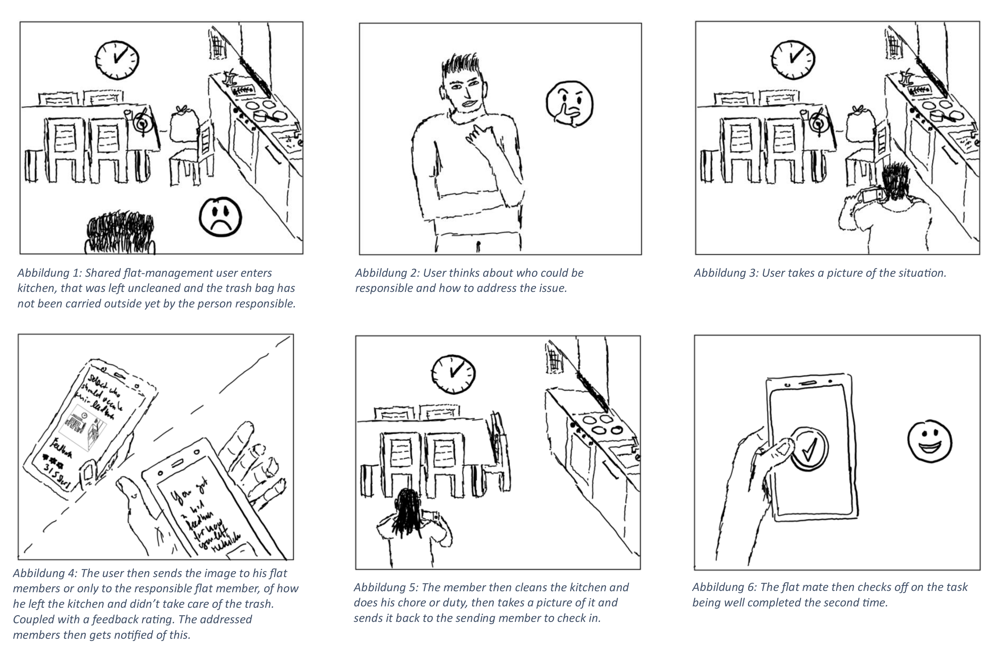
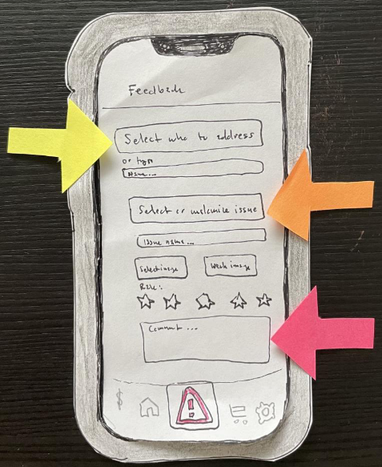
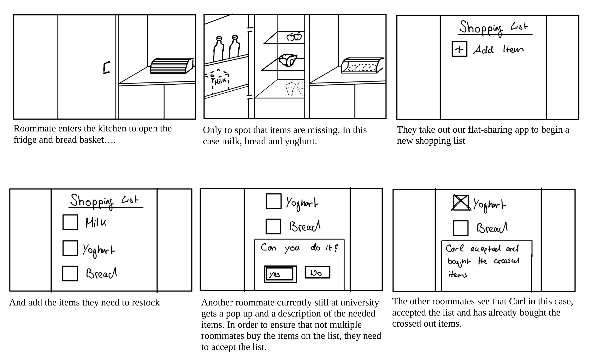
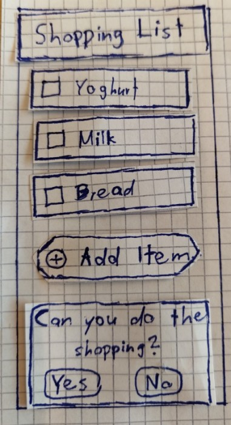
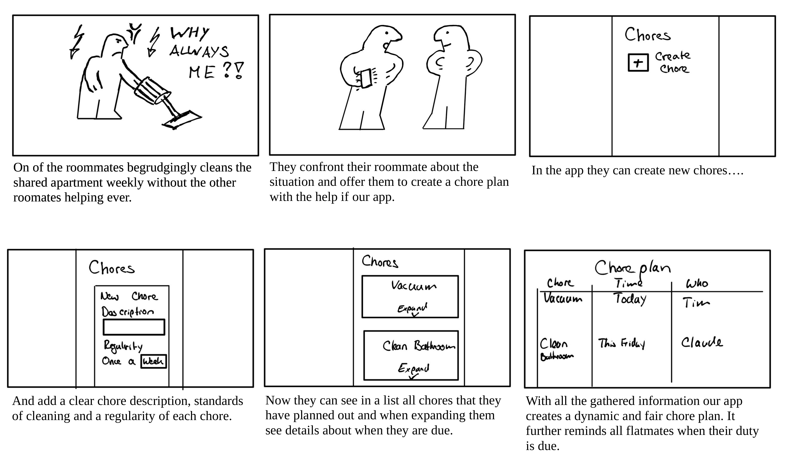

   &nbsp; &nbsp;
  

# Shared Flat Management, Group 25

#### Simon Streuli, Josh Anderegg, Nic Schellenbaum, Florian Affolter,  Jannek Ulm, Douglas Orsini-Rosenberg

## Project description

    

Ever lived with roommates? If so, you know that managing shared expenses, chores, and hangouts can sometimes get... well, messy. And let’s face it - while living with others can be fun and wallet-friendly, it's no secret that it comes with its fair share of challenges, from that ever-growing pile of unwashed dishes to the mystery of who last paid the internet bill.

That’s why we’re  excited to be working on a new app designed to make shared living just a bit easier. Think of it as your friendly flatmate who’s always got your back, helping you keep track of bills, chores, and who’s turn it is to buy toilet paper next. 🧻💸

With our app, we're not just aiming to bring order to the chaos of shared expenses and tasks but also hoping to make co-living more enjoyable and conflict-free! 🎉

Stay tuned, and let’s make the shared living dream a smooth-sailing reality together! 🚢🏠

## Week 02/03: User Interviews

In the development process of our shared flat management app, this week was especially insightful. Engaging directly with potential users, we focused our efforts on conducting user interviews, crucial for a user-centred design approach.

Understanding user needs, experiences, and pain points is paramount to inform and guide our design principles and processes. The aim is to create a tool that genuinely simplifies and enhances the co-living experience for its users, addressing actual issues they face in their day-to-day shared living situation.

We conducted a total of 12 interviews, extracting valuable data from varied experiences and stories of individuals living in shared flats. This data will directly influence our design and development decisions, ensuring our app is tailored to meet real, identified needs and provide practical, useful solutions.

The interview questions were meticulously crafted, targeting various aspects of shared living. Here’s the  list of questions we asked:

Interview Questions

<ul>
    <li><b>General User Understanding:</b>
        <ul>
            <li>What motivated you to choose shared living?</li>
            <li>Could you describe a typical day or routine in the flat?</li>
            <li>What do you appreciate most about living in a shared flat?</li>
            <li>What challenges have you encountered regarding management or general living in a shared flat?</li>
        </ul>
    </li>
    <li><b>Communication and Coordination:</b>
        <ul>
            <li>How do you navigate communication with your flatmates concerning shared responsibilities and issues?</li>
            <li>Can you cite instances of communication hurdles with your flatmates?</li>
            <li>What tools or strategies do you employ for coordinating tasks and responsibilities within the flat?</li>
        </ul>
    </li>
    <li><b>Cost Sharing:</b>
        <ul>
            <li>How are shared expenses like rent, utilities, and groceries managed and divided amongst you?</li>
            <li>Have there been instances or issues related to financial contributions or reimbursements?</li>
            <li>Is there an element of cost-sharing that you find particularly challenging or perplexing?</li>
        </ul>
    </li>
    <li><b>Conflict Resolution:</b>
        <ul>
            <li>Have conflicts or disagreements with flatmates occurred, and how were they resolved?</li>
            <li>What strategies or methods do you believe could enhance conflict resolution within shared flats?</li>
        </ul>
    </li>
    <li><b>Maintenance and Cleaning:</b>
        <ul>
            <li>How is the management of cleaning and maintenance tasks orchestrated within your shared flat?</li>
            <li>Are there specific cleaning or maintenance tasks that are commonly neglected or cause disputes amongst flatmates?</li>
        </ul>
    </li>
    <li><b>Privacy and Personal Space:</b>
        <ul>
            <li>How is privacy and personal space managed within the shared living scenario?</li>
            <li>Have there been instances where you felt your privacy was respected or invaded by flatmates?</li>
        </ul>
    </li>
    <li><b>Safety and Security:</b>
        <ul>
            <li>What measures or precautions do you and your flatmates take regarding safety within the shared flat?</li>
            <li>Have there been incidents, which in your opinion, could have been averted with better management?</li>
        </ul>
    </li>
    <li><b>Technology and Tools:</b>
        <ul>
            <li>Are there existing apps, software, or tools that aid in managing your shared living situation?</li>
            <li>What features or capabilities would you like to see in a platform or app designed for managing shared flats?</li>
        </ul>
    </li>
    <li><b>Guests and Visitors:</b>
        <ul>
            <li>How do you manage guests and visitors within your shared living space?</li>
            <li>Have there been challenges related to guests that you think could be managed more effectively?</li>
        </ul>
    </li>
</ul>

&nbsp;

Here you can find the summaries to each of the interviews we conducted

  
 Interview Summaries

### Interview 1: Christoph

  Christoph is a 23 year old student who lives together with 3 people in a shared flat. He chose to live in a shared flat as it's the cheapest way of moving out. He described his living situation as pragmatic and not familiar in the sense that they don't eat together, or hang out together on a regular basis.
  Not every flatmate is doing their chores diligently and timely, he therefore needs a way to organise and communicate with them who does what and when. Communication among flatmates can be difficult, as not everyone is around all the time and sometimes it's just uncomfortable to critise peers on their cleanliness, he wishes for a way in which this communication can be less direct and problems easier showcased. He also expressed the need for a way to verify who buys what, as it happened multiple times that someone asked in the group chat if someon could buy an item and multiple people ended up buying one.
  One insight to take away from the interview is that communication and organisation of chores, issues and shopping is essential for flat management.

### Interview 2: Nicolina

  Nicolina is a 22 year old student who lives together with 2 people in a shared flat. She chose to move out and a flat was simply the cheapest way of doing so. The living situation is somehwat familiar, as the flatmates eat together and also share a friend group.
  Issues within the shared flat mainly arise from flatmates not cleaning up after themselves, as well as miscommunications when it comes to tending the two cats. Communication can be difficult as some flatmates simply ignore, or forget critisism that was given for certain actions. She also does not want for a stricter organisation of chores or more rules, much rather a way to communicate having more common sense when it comes to flat management and cleanliness.
  One insight to take away from the interview is that stricter organisation is not necessarily something flatmates want, the end goal is having a clean apartment, which can be achieved by being more considerate in general.

### Interview 3: Emil

  Emil is a resident in a shared flat motivated by the high rental prices in Zurich. His typical day involves limited interaction with flatmates, mainly during university days, and he values the convenience of not buying communal items. Emill’s biggest challenge in the WG is finding compromises among flatmates. They primarily use WhatsApp and kitchen interactions for communication and Flatastic for cost-sharing. There have been no major financial issues, and he is generally satisfied with the cost-sharing process. Conflict resolution is rare due to minimal interaction. He places a strong emphasis on personal bedroom privacy and mentions no significant safety concerns. Flatastic is their preferred app for managing the flat, with a desire for improved expense categorization.

### Interview 4: Sophie

  Sophie chose to live in a shared flat to cohabit with her friends and follows a daily routine of work and shared activities. She appreciates the companionship and values the ability to share plans and time with flatmates. Sophie’s biggest challenge is the clear communication of shared standards and expectations. Communication with flatmates primarily occurs in person, addressing responsibilities and setting rules. Some communication issues revolve around topics like hanging jackets and meal coordination. They use both digital and paper notes for coordination. They are using Flatastic for shared expenses and are generally satisfied, though wishes for more detailed financial tracking are there. Conflicts are resolved through timely discussions. Sophie desires a simple, user-friendly flat management platform with categorized financial accounting.

### Interview 5: Marvin

  Marvin is 21 years old, studies economics at UZH and lives in a flat in Winterthur with 2 old schoolmates and 2 cats. He moved out to be more independent, but he still likes to interact with his flatmates occasionally. In his flat, food is generally shared, so there are many small expenses which he would like to track easily. He would also like to use a system to distribute chores, as right now things like taking out the trash often don't get done in a timely manner. He would also like some system to resolve conflicts before they negatively affect the atmosphere in the flat.

### Interview 6: Carl

  Carl is 23 years old, studies mechanical engineering at ETH and lives in a flat with a friend close to Zurich. He isn't at home very often, and he and his roommate don't interact very often in their day to day life. They have separate compartments in their fridge, so they don't share many expenses, because of which Carl doesn't want an application to handle the finances. Communication is not always easy however, and complaints about orderliness in the kitchen often go ignored, so Carl would like some way to "shame" his roommate to better his behaviour in the long term.

### Interview 7: Max

  Max (23) has experience living in a shared flat with three flatmates. They lived in a shared flat primarily because of its proximity to the campus. Their needs include a system for splitting and tracking shared expenses, improved communication for resolving minor conflicts, and a chores reminder, though they prefer paper-based chore planning.
  They don't see a specific need for a dedicated app, as most communication happens in person or through text messages, and chores are managed on paper. If an app were available, they would consider it primarily for expense splitting but might also explore additional features.

### Interview 8: Mario

  Mario previously shared a flat with three flatmates, including Max, and has recently moved into a flat with just one other person. Their motivations for shared living are mostly cost-sharing, social interactions, and maintaining independence.
  There are existing tools for managing shared flats, both paper-based and in app form, but a single, comprehensive app would be preferred.
  A noteworthy insight was that the complexity of managing a household scales with its size.

### Interview 9: Jonas

  Jonas (24),student, decided on a shared living arrangement to cut down costs and for the appealing social aspect of community living. He follows a routine of quick breakfasts, working, and sometimes cooking with roommates in the evenings, after which they might hang out together or he spends time alone in his room. He appreciates the companionship and shared experiences most about living in a shared flat. Nevertheless, managing different lifestyles and coordinating cleaning schedules have proven to be significant challenges. Conflicts, particularly related to cleanliness and noise, sometimes go unresolved as forcing roommates to comply can be tough. They use WhatsApp and a fridge cleaning plan (which often gets ignored) for coordination and Splitwise for managing shared expenses like utilities. Occasionally, Jonas has to remind roommates to contribute financially. The bathroom often becomes a contention point due to varied cleanliness standards, and unannounced visits from roommates sometimes impinge on his privacy.

### Interview 10: Mark

  Mark (23),student, chose shared living motivated by the prospects of making new friends and moving out of his family home. His day typically involves university in the morning, studying or working part-time in the afternoon, and evenings are often for either solo or communal cooking sessions. Constant company and divided responsibilities are the aspects he enjoys most about his living situation. However, challenges arise in managing noise, especially during exam periods, and aligning on cleaning habits. When it comes to shared responsibilities and issues, communication usually happens personally or via a WhatsApp group, but issues like last-minute guest arrangements and providing criticism can be problematic. Their method of dealing with cleaning and maintenance involves a cleaning schedule, although without strict rules, leading to the living room often being neglected in the cleaning rotation. Guest visits are usually flexible as long as it's not too late or loud, but unplanned overnight stays in the living room have been a problem. Mark sees a need for a more organized set of rules and a better system for financial overviews in the shared living setup.

### Interview 11: Michael

  Michael finds shared living beneficial primarily for financial and social reasons but identifies cleanliness as a key challenge due to varying standards among flatmates. Communication channels utilized include direct interactions and WhatsApp, particularly when resolving issues that often crop up with changing roommates. Apps like Splitwise and Flatastic assist in managing finances and sharing costs of common purchases, though determining what should be bought communally can be tricky. Important conflict resolution often takes place during essential flat meetings. A desired feature in flat management apps is a tick-list. An open approach to hosting guests is common practice in the flat.

### Interview 12: Sandra

  Sandra acknowledges the shared financial and initial communal advantages of living in a flatshare, appreciating aspects like workload distribution and mutual support, especially during times of illness or absence. Challenges she encounters encompass discrepancies in cleanliness and responsibility, synchronized bathroom usage, concurrent utilization of common areas for varied activities, and differences in dietary and furnishing preferences. Communications, whether regarding finances or cleanliness standards, are conducted personally, or via WhatsApp, task lists, or in extreme cases, issuing terminations. While they use apps like Flatastic and Excel for financial and task management, Sandra wishes for a feature that allows regular financial reconciliations without constant manual input. Conflict resolution strategies range from discussions to terminations. As the primary tenant, Sandra seeks more recognition for her efforts and responsibilities. Continuous male visitors and an unlockable bathroom are sources of inconvenience. She also desires attention from administration regarding safety in the flat’s basement. An open policy regarding guests is maintained.

<!-- -->
<!-- -->
&nbsp;

You can find the interview notes for each interview [here](Deliverables/Needfinding)

From the interviews, we learned that a successful app for shared living needs to prioritize facilitating smooth communication between flatmates and providing robust expense and chore management tools. The varied living situations and preferences expressed by the interviewees highlight the importance of making these features customizable and user-friendly. Privacy concerns and the balancing act between structured living and flexibility also emerged as significant points, indicating that our app should offer varied solutions to cater to different household dynamics and individual preferences. This insight from real-life shared living situations will be crucial in developing an app that can genuinely cater to the needs of its users.

### Affinity Diagram

From the above interviews we compiled an affinity diagram using virtual Post-it notes. It contains the most important findings across the three categories "user", "needs" and "insights".

## Week 04: Desk research, "How might we" statements, Brainstorming

### Desk Research

To get additional insights, other than from the interviews, we conducted desk research. We looked at existing apps that are used for shared flat management and at articles and forum posts discussing such apps. Of special interest to us were the features that these apps offer, and their reviews on the app stores to see what users like and dislike about them.

The detailed research can be found [here](Deliverables/Desk%20Research).

In general, apps used for flat management can be divided into two categories: apps that provide a more holistic approach and try to implement a range of features which might be used in a co-living context, and apps that focus on a specific aspect of shared living. In the latter, most apps focus either on finance splitting or on chore management.

The general sentiment among users seems to be that one app for everything is preferred, especially since everyone has to install the same app(s). However, those monolithic apps are more often than not lacking crucial features which many users would like to see. Apps which specialise on only one aspect of shared living are generally better at what they do, but users are reluctant to install multiple apps for different purposes.

A "perfect" shared flat managment app should therefore provide a range of features, but also has to be very good at it, which is hard to achieve. Furthermore it is important, that it is easy to onboard new users, as it is hard to convince everyone to install a new app. Also, the app should be easy to use for simple tasks; many features may quickly become overwhelming.

In the most important aspects, expense splitting and chore management, the featureset of most apps is pretty similar, whether they are specialised or not. Some of the most important features are:
* **All categories**
  * Easy onboarding of new users
  * One shared group where everyone can see everything
* **Expense splitting**
  * Expense logging, with the possibility to add a picture of the receipt
  * Expense splitting, with the possibility to split unevenly
  * Built-in payment solutions, like connected PayPal or bank accounts
* **Chore management**
  * Adding shared chores
  * Assigning chores to specific people
  * Setting deadlines and reminders
  * Have a (personlaized or general) list of open tasks

### "How might we" statements

Based on the insights from the interviews and the desk research, we created the following open-ended "How might we" statements to guide our brainstorming process:

1. How might we ensure that essential supplies are always stocked up, but not bought multiple times. 
2. How might we ensure that all flatmates consistently engage and actively participate in using the app? 
3. How might we make sure that the users keep information and responsibilities up to date? 
4. How might we design a task management system that is flexible and adaptable? 
5. How might we organize the flat in a way where everyone is satisfied with the cleanliness and/or execution of chores? 
6. How might we create an easy and quick method for flatmates to assign and swap chores? 
7. How might we help flatmates remember their assigned tasks and upcoming payments? 
8. How might we ensure that expenses are divided fairly and paid on time?

### Brainstorming

We then used the "How might we" statements to brainstorm ideas for features that our app could have. We used the brainstorming approach **B**, where everyone first brainstorms individually, then shares their ideas with the group, which then reiterates on the ideas and builds up on them. We did the raw brainstorming and the clustering into ideas at once, using virtual Post-it notes.

## Week 05: Storyboards, Low-fidelity Prototyping
This week, we extracted three ideas from the previous week's brainstorming session which we wanted to pursue and develop into a solution. To really illustrate how we envision that our ideas will improve living in a shared flat, we created a storyboard for those three, each of which features a common problem according to our previous research, and how the idea counteracts that problem. Then, for two of the ideas, we created a low-fi paper prototype, modeling possible implementations of those ideas. The purpose of these is to be able to give a demonstration of how a final, high-quality implementation could look and feel, without having to invest much time and money.

### Idea A: Feedback System
In our needfinding process, we found that many people are bothered by roommates not doing their chores properly or at all. But as identifying the culprit and then confronting them about it is unpleasant for many people, we came up with the idea of a sort of digital notice board, where the user can anonymously give feedback to a specific or all roommates. In the case of negative feedback, this will hopefully encourage the culprit to improve in both the short and long term, but the feature can also be used to highlight good behaviour.

 

#### Storyboard

#### Paper Prototype
More pictures can be found [here](Deliverables/LowFiPrototyping/IdeaA/Paper.pdf).

### Idea B: Shopping List
Everyone living in a shared flat has probably at some point run out of something, be it milk, bread, or even something such as toilet paper. To avoid such things from happening or stuff being bought multiple times, we prototyped a simple shopping list. To circumvent two people going shopping at the same time, we added an option to indicate when someone has agreed to go shopping later that day, or also if someone said that they currently can't. Then, the person responsible can either cross off the items one by one as they put the items into their basket or after they already left the shop. 

#### Storyboard

#### Paper Prototype
More pictures can be found [here](Deliverables/LowFiPrototyping/IdeaB/Paper/).

### Idea C: Chore Manager
Without some sort of chore plan, sooner or later a person is likely to be the one to pull most of the weight in the flat, or a chore is left undone for a long time. To fix this, we prototyped a chore manager, where the people living in the flat can specify together which chores need to be done and how often. These are then distributed fairly amongst the flatmates, and displayed in a nice chore plan, indicating whose turn it is and when they are due.

#### Storyboard

## Week 05: Mid-fidelity prototyping
This week we turned our focus towards building two mid-fidelity prototypes from our previous findings. Analyzing the storyboards that we created and taking into account of how our prototypes felt and could be implemented, we realized that we should make a change of course. Instead of pursuing our idea of a feedback system for the flat-members, we decided it that we should focus on the shopping list feature and the chore manager. The rationale behind this is the fact that we want to be able to focus on the users interaction and experience of the features. For the feedback system we would have to focus too much on the functionality. This realization came as we thought it would be more interesting to create a feedback system and decided to build a low-fi prototype for it and realized that making it work intuitively could become quite a challenge in terms of functionality. So we proceeded with designing possible user interfaces for the shopping list and the chore manager. After iterating over several designs using figma, we ended up with two complementing but quite different ideas.

### Mid-fi prototype Idea B: Shopping List

#### Motivation
In the past weeks we identified user needs, users and gained insights, followed by desk research leaving us with only three storyboards and two low-fi designs. One of which we don't want to develop further. We decided to further investigate the idea of a shopping list for a shared-flat. Doing groceries is one of the core aspects and advantages of living together but also one of the biggest challenges. As such we wanted to see how we could do, implementing an interactive, intuitive and user-friendly design.

#### Walk-through
The broad application has you navigating through login menu, which can be followed by creating an account. Then you have the possibility to join a flat group or create your own (we weren't sure if we should allow the option to be part of several flats). Within the app you can then navigate to the grocery menu. There awaits you a list of items and food you and your flat-members need. These could be ordered by categories in the backend. There is a priority switch-button which suggests urgency by allocating the item further up in its category. The big plus of our shopping list allows you to add a new item. In the add new item menu you can specify a new product with its name, configure its quantity and set if its urgent. This is convenient as you can plan buying soap before its empty and allow users to buy it when its on sale. There is also recommendations of frequently bought items. Of course there is also the possibility to edit existing entries by clicking on them. For a video walk-through click [here](Deliverables/MidFiPrototyping/Prototype%20A%20-%20Shopping%20List/Shopping_List_Management-720p.mov).

#### Design
##### Login menu

##### Create account menu

##### Shared flat setup menu

##### Shopping list initial menu

##### Add item menu

##### Edit item menu

### Mid-fi prototype Idea C: Chore Manager

#### Motivation
Everyone who has ever lived with someone has had the expectation of splitting the work around the house, flat or apartment more or less fairly. Without going further into the notion of fairness, the usual way to go about this is to make a list of tasks that need to be done and then distribute them across the flat-members. This quickly poses challenges on the living community. Does everyone do their task on time? Are some tasks way more time-consuming than others? How to keep track of who did, does and is going to do which task? We've established this strong need (need for a chore manager) for a solution in the past week of our research and analysis (also described in the motivation for the shopping list). We find it important to design a simple, inviting and exciting way of tackling these challenges as it builds the foundation of any shared-flat application just like a shopping list.  

#### Walk-through

  
#### Design
##### Assigned To View

##### Due date View

##### Room view

##### Detailed info per task

##### Add new task

## Week 06: Mid-fidelity Prototype Feedback

During this week, our group was divided into two teams: one team provided feedback to other groups, while the other team presented our two prototypes to these groups. Specifically, Josh, Nic, and Simon had the opportunity to test the prototypes of groups 14, 20, and 10 respectively. Meanwhile, Douglas and Jannek took on the role of presenting our prototypes to groups 26, 31, 32, and a Teaching Assistant. As a result of these interactions, we gathered valuable feedback that we'd like to share with you:

### Login Screen:
- Generally positive feedback; no major issues highlighted.
- The button to create a new flat was not clearly visible and should be displayed more centrally.
- Suggestion to add an overall overview screen showing flat group members.

### Shopping List:
- Confusion about the "!" symbol.
- The location for adding items is not intuitive; the top bar resembles a button.
- Categories appear button-like, suggesting a need for UI modifications.
- Button design for marking items as bought needs improvement.
- Suggestion to add an onboarding tutorial to explain the "!" symbol.
- Praise for the automatic category feature and the recommendation feature.

### Task/Chore Manager:
- The "Bell" icon is not clear in its functionality, specifically that it sends notifications to the assignee.
- The collapsing feature lacks intuitive design.
- Suggestions for enabling changes in chore assignment policies (e.g., from round-robin to fixed person assignment).
- Proposal to introduce default chore recommendations during the setup phase to ease user onboarding and improve initial app understanding.
- Users initially ignored the 3-column filter buttons; suggested combining them for better sorting.
- Feedback on the visibility of other people's chores.
- Difficulty recognizing the button design for marking tasks as done; liked the notification feature.
- Suggestion to add visual indicators for collapsible rooms and bubbles for rooms with assigned chores.

### Other Comments:
- Emphasis on the iterative process of brainstorming, prototyping, and other stages of development to demonstrate evolution and growth of the project.
- Appreciation for the automatic categorization feature.

### Bridging to the Next Iteration

From the feedback we received, there's a clear indication that both the shopping list and the Task/Chore Manager have areas for improvement. Yet, instead of spreading our efforts across both, we've chosen to focus exclusively on the Task/Chore Manager for the next iteration. This decision isn't about merely creating a functional app; it's about striving for perfection in one core segment of our application first. Further we also gathered the valuable insight from each of the participants that the Chore Manager is the much more essential feature for managing a shared flat. Hence we want to focus and continue with the Chore Manager in the High Fidelity prototyping stage.

The feedback spotlighted several nuances within the Task/Chore Manager, from the clarity of icons to the intuitiveness of its features. By directing our energy here, we can delve deep into refining the user experience, ensuring every facet is honed to perfection. This focused approach aligns with our goal to apply and embody the UI/UX concepts from the lecture to the fullest. Ultimately, our vision is for an app that is not only fully functional but also optimal in every aspect. We aim for every feature and detail to be well thought out and tailored to the user's needs, ensuring a seamless and beneficial experience.

We've chosen Flutter for our high-level prototype for a number of reasons:

1. **Flexibility and Customization:** Flutter allows us to customize every pixel on the screen, providing us the liberty to implement the specific UI changes suggested in the feedback.
2. **Rapid Iteration:** With its hot reload feature, Flutter enables faster iterations, making it easier to experiment with different UI/UX solutions.
3. **Consistent Experience:** As a cross-platform framework, Flutter ensures that our prototype maintains consistency across different devices, allowing us to gather feedback from a wider range of users.

Based on the new feedback, there is a clear need to further improve both the shopping list and the Task/Chore Manager. Consider focusing on the following areas for the next iteration:

### Shopping List:
- Improve the "!" symbol's clarity and provide an onboarding tutorial for this feature.
- Enhance the button design for marking items as done.
- Continue to explore automatic categorization features.
- Highlight user-friendly features like item recommendations and visibility of item additions.

### Task/Chore Manager:
- Clarify the meaning of icons like the bell and button design for marking tasks as done.
- Consider combining filter options to provide more user-friendly sorting.
- Explore options to reduce the visibility of other people's chores.
- Enhance the notification feature's visibility and usability.
- Add visual indicators for collapsible rooms and bubbles next to rooms with assigned chores to improve the overview.

Overall, the feedback highlights the importance of clear onboarding and intuitive design in both app prototypes, with an emphasis on user education and feature visibility.

## Week 07: User Study and Hi-fidelity prototype
During this week our team planned how we want to conduct our user study and further brainstormed about our Hi-fidelity prototype. As we've decided last week we'll focus on the chore/task-manager part of our app and develop two prototype variants A, B accordingly. As discussed with a teaching assistant during the exercise session we've focused on finding a sweet spot between creating enough variation between prototypes, to conduct an interesting user study, but not too much, to keep the independent variables clear.

### Prototype variants
#### Variant A
Prototype variant A matches what we've done in the mid-fidelity prototype. A task overview which lets us switch between different modes to structure and sort tasks. In detail: structuring tasks by due date, by assignee and by room. Tasks are shown as a list of tasks, and each task can be expanded by pressing on it to reveal more details.

#### Variant B
For prototype B we focus more specifically on the user. When opening the app, the first thing you see are all tasks that are assigned to you with more initial information provided as in the first prototype, whatever was only visible in A by expanding the task is visible already in B. When accessing all items, not only the ones assigned to the respective user, a mode switch is required to a different menu. This menu will list all tasks similarly as prototype A did, with the need to expand the tasks for more information.

### Description of the user study
#### Goal
The goal of the user study is now to examine with which variant participants find tasks and information about them quicker, make less errors when reading the data and ultimately which variant they prefer using.

One thing we noticed from the peer-feedback last week was, that not many people utilised the mode switch of variant A, inspiring us to try something new for structuring the tasks presented. Users are mainly interested in finding out what they have to do, which is how we came up with variant B as it is now.

We believe that the iteration from A to B is substantial enough to see usability improvements, both in the time needed to navigate the app and in the errors made when reading task descriptions.

#### Hypotheses
There will be no effect of using variant B over A on ...
1. the time needed to see which of my tasks are due in the next days.
2. the time needed to read the information of any task (mine, or of someone else).
3. reading the full and correct information of any task.
4. the perceived ease of use from the users perspective.

#### Data Collection
1. We'll collect anonymized participant data, focusing on their previous experience with flat sharing apps and their current living situation.
2. We'll collect subjective rating
3. We'll collect performance data by capturing the screen while the users navigate the app. The performance data consists of the time needed to finish a certain task and how well they read the information on the screen. The latter will be measured by hiding messages in the task description and evaluating if they picked up on the messages afterwards.
4. Lastly we'll also collect qualitative feedback by simply taking notes and talking with the participants at the end of the study.

#### Experiment procedure
The participants will be asked to familiarise themselves with the app by adding, searching and reading a small number of chores from the app. We'll change the app session, such that participants can't learn the exact position of tasks and let them search and analyse chores in each variant respectively. Details can be read in the [Preliminary Study Protocol](Deliverables/Study/Preliminary_Protocol.pdf)

Overall the user study should give us insight about how efficiently and joyfully participants can work with our app. Carving the way for another iteration of our app.

## Week 11: Pilot study and testing preliminary protocol
This week marked a crucial phase in our project as we conducted the first user test on our prototype. The experience served as a valuable reality check, highlighting the need for quick fixes to enhance the prototype's functionality. To address these issues, we promptly implemented adjustments and proceeded with a pilot study.

The initial stages of the study were promising, featuring a friendly introduction that engaged the user and provided context without overwhelming them. However, it became apparent that our approach to documenting data required modification. We shifted from screen recording to using a stopwatch, enabling more precise measurement. The previous method made it challenging to discern when the user initiated and completed a task.

To refine our time measurement process, we developed a simple protocol to clearly mark the start and end of each task. Additionally, we identified a task that needed adaptation to cater to both Type A and Type B users. Originally, the task involved searching for a category, but we revised it to have users search for specific information within that category. This adjustment ensured a more inclusive and comprehensive evaluation.

As part of our study, we integrated the NASA Task Load Index (NASA TLX) questionnaire, providing additional insights into the user experience. Observing users set up the app, interact with it, and take their initial steps was enlightening. Overall, the pilot study offered valuable insights into the user's perspective and allowed us to fine-tune the study.

## Weeks 12-14: Prototype development, user study
In the weeks 12-13 all group member conducted the study on two participants each and  collected the data accordingly to the final study protocol. From there on out all members refined different aspects of our project concurrently.

- Some focused on writing the [study report]([Deliverables/Study_Report_HCI-Group 25.pdf](https://github.com/eth-hci-course/hci-project-hci2023-group-25/blob/2023/Deliverables/Study_Report_HCI-Group%2025.pdf)), which formalised, analysed and reported our study.
- Some refined the prototype to look and fell more responsive and well thought through. As well as providing instructions on how to run it yourself.
- Some created a video as a means of presenting the whole project and showcasing our prototype.
- Some worked on the given [Bonus exercise](Deliverables/Bonus/bonus_2023/bonus_exercise.ipynb) which was about finding an optimal keyboard layout.
  
Overall the final weeks we're the most productive ones. With everyone tying up different loose ends, to create a satisfactory prototype, a sound and extensive stud report and a short presentation to wrap-up our whole project. 
