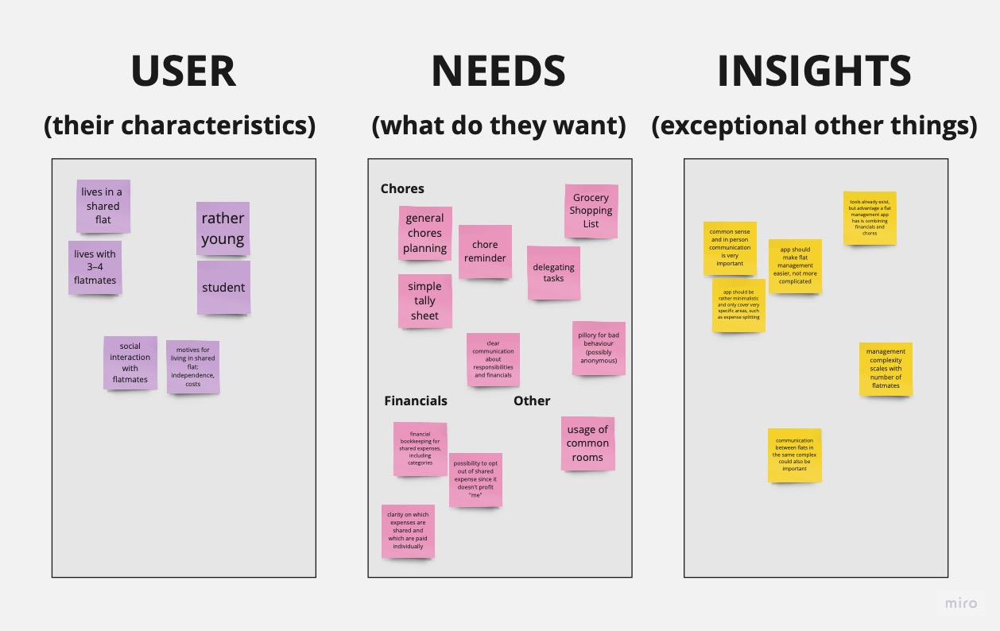
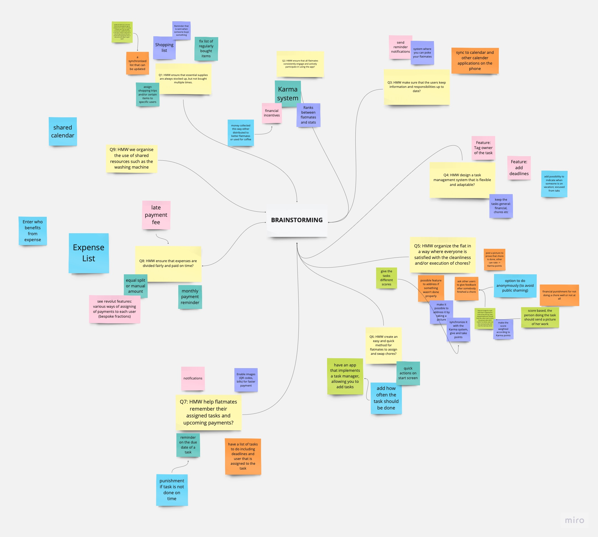

   &nbsp; &nbsp;
  

# Shared Flat Management, Group 25

#### Simon Streuli, Josh Anderegg, Nic Schellenbaum, Florian Affolter,  Jannek Ulm, Douglas Orsini-Rosenberg

## Project description

    

Ever lived with roommates? If so, you know that managing shared expenses, chores, and hangouts can sometimes get... well, messy. And let’s face it - while living with others can be fun and wallet-friendly, it's no secret that it comes with its fair share of challenges, from that ever-growing pile of unwashed dishes to the mystery of who last paid the internet bill.

That’s why we’re  excited to be working on a new app designed to make shared living just a bit easier. Think of it as your friendly flatmate who’s always got your back, helping you keep track of bills, chores, and who’s turn it is to buy toilet paper next. 🧻💸

With our app, we're not just aiming to bring order to the chaos of shared expenses and tasks but also hoping to make co-living more enjoyable and conflict-free! 🎉

Stay tuned, and let’s make the shared living dream a smooth-sailing reality together! 🚢🏠

## Week 02/03: User Interviews

In the development process of our shared flat management app, this week was especially insightful. Engaging directly with potential users, we focused our efforts on conducting user interviews, crucial for a user-centred design approach.

Understanding user needs, experiences, and pain points is paramount to inform and guide our design principles and processes. The aim is to create a tool that genuinely simplifies and enhances the co-living experience for its users, addressing actual issues they face in their day-to-day shared living situation.

We conducted a total of 12 interviews, extracting valuable data from varied experiences and stories of individuals living in shared flats. This data will directly influence our design and development decisions, ensuring our app is tailored to meet real, identified needs and provide practical, useful solutions.

The interview questions were meticulously crafted, targeting various aspects of shared living. Here’s the  list of questions we asked:

Interview Questions

<ul>
    <li><b>General User Understanding:</b>
        <ul>
            <li>What motivated you to choose shared living?</li>
            <li>Could you describe a typical day or routine in the flat?</li>
            <li>What do you appreciate most about living in a shared flat?</li>
            <li>What challenges have you encountered regarding management or general living in a shared flat?</li>
        </ul>
    </li>
    <li><b>Communication and Coordination:</b>
        <ul>
            <li>How do you navigate communication with your flatmates concerning shared responsibilities and issues?</li>
            <li>Can you cite instances of communication hurdles with your flatmates?</li>
            <li>What tools or strategies do you employ for coordinating tasks and responsibilities within the flat?</li>
        </ul>
    </li>
    <li><b>Cost Sharing:</b>
        <ul>
            <li>How are shared expenses like rent, utilities, and groceries managed and divided amongst you?</li>
            <li>Have there been instances or issues related to financial contributions or reimbursements?</li>
            <li>Is there an element of cost-sharing that you find particularly challenging or perplexing?</li>
        </ul>
    </li>
    <li><b>Conflict Resolution:</b>
        <ul>
            <li>Have conflicts or disagreements with flatmates occurred, and how were they resolved?</li>
            <li>What strategies or methods do you believe could enhance conflict resolution within shared flats?</li>
        </ul>
    </li>
    <li><b>Maintenance and Cleaning:</b>
        <ul>
            <li>How is the management of cleaning and maintenance tasks orchestrated within your shared flat?</li>
            <li>Are there specific cleaning or maintenance tasks that are commonly neglected or cause disputes amongst flatmates?</li>
        </ul>
    </li>
    <li><b>Privacy and Personal Space:</b>
        <ul>
            <li>How is privacy and personal space managed within the shared living scenario?</li>
            <li>Have there been instances where you felt your privacy was respected or invaded by flatmates?</li>
        </ul>
    </li>
    <li><b>Safety and Security:</b>
        <ul>
            <li>What measures or precautions do you and your flatmates take regarding safety within the shared flat?</li>
            <li>Have there been incidents, which in your opinion, could have been averted with better management?</li>
        </ul>
    </li>
    <li><b>Technology and Tools:</b>
        <ul>
            <li>Are there existing apps, software, or tools that aid in managing your shared living situation?</li>
            <li>What features or capabilities would you like to see in a platform or app designed for managing shared flats?</li>
        </ul>
    </li>
    <li><b>Guests and Visitors:</b>
        <ul>
            <li>How do you manage guests and visitors within your shared living space?</li>
            <li>Have there been challenges related to guests that you think could be managed more effectively?</li>
        </ul>
    </li>
</ul>

&nbsp;

Here you can find the summaries to each of the interviews we conducted

  
 Interview Summaries

### Interview 1: Christoph

  Christoph is a 23 year old student who lives together with 3 people in a shared flat. He chose to live in a shared flat as it's the cheapest way of moving out. He described his living situation as pragmatic and not familiar in the sense that they don't eat together, or hang out together on a regular basis.
  Not every flatmate is doing their chores diligently and timely, he therefore needs a way to organise and communicate with them who does what and when. Communication among flatmates can be difficult, as not everyone is around all the time and sometimes it's just uncomfortable to critise peers on their cleanliness, he wishes for a way in which this communication can be less direct and problems easier showcased. He also expressed the need for a way to verify who buys what, as it happened multiple times that someone asked in the group chat if someon could buy an item and multiple people ended up buying one.
  One insight to take away from the interview is that communication and organisation of chores, issues and shopping is essential for flat management.

### Interview 2: Nicolina

  Nicolina is a 22 year old student who lives together with 2 people in a shared flat. She chose to move out and a flat was simply the cheapest way of doing so. The living situation is somehwat familiar, as the flatmates eat together and also share a friend group.
  Issues within the shared flat mainly arise from flatmates not cleaning up after themselves, as well as miscommunications when it comes to tending the two cats. Communication can be difficult as some flatmates simply ignore, or forget critisism that was given for certain actions. She also does not want for a stricter organisation of chores or more rules, much rather a way to communicate having more common sense when it comes to flat management and cleanliness.
  One insight to take away from the interview is that stricter organisation is not necessarily something flatmates want, the end goal is having a clean apartment, which can be achieved by being more considerate in general.

### Interview 3: Emil

  Emil is a resident in a shared flat motivated by the high rental prices in Zurich. His typical day involves limited interaction with flatmates, mainly during university days, and he values the convenience of not buying communal items. Emill’s biggest challenge in the WG is finding compromises among flatmates. They primarily use WhatsApp and kitchen interactions for communication and Flatastic for cost-sharing. There have been no major financial issues, and he is generally satisfied with the cost-sharing process. Conflict resolution is rare due to minimal interaction. He places a strong emphasis on personal bedroom privacy and mentions no significant safety concerns. Flatastic is their preferred app for managing the flat, with a desire for improved expense categorization.

### Interview 4: Sophie

  Sophie chose to live in a shared flat to cohabit with her friends and follows a daily routine of work and shared activities. She appreciates the companionship and values the ability to share plans and time with flatmates. Sophie’s biggest challenge is the clear communication of shared standards and expectations. Communication with flatmates primarily occurs in person, addressing responsibilities and setting rules. Some communication issues revolve around topics like hanging jackets and meal coordination. They use both digital and paper notes for coordination. They are using Flatastic for shared expenses and are generally satisfied, though wishes for more detailed financial tracking are there. Conflicts are resolved through timely discussions. Sophie desires a simple, user-friendly flat management platform with categorized financial accounting.

### Interview 5: Marvin

  Marvin is 21 years old, studies economics at UZH and lives in a flat in Winterthur with 2 old schoolmates and 2 cats. He moved out to be more independent, but he still likes to interact with his flatmates occasionally. In his flat, food is generally shared, so there are many small expenses which he would like to track easily. He would also like to use a system to distribute chores, as right now things like taking out the trash often don't get done in a timely manner. He would also like some system to resolve conflicts before they negatively affect the atmosphere in the flat.

### Interview 6: Carl

  Carl is 23 years old, studies mechanical engineering at ETH and lives in a flat with a friend close to Zurich. He isn't at home very often, and he and his roommate don't interact very often in their day to day life. They have separate compartments in their fridge, so they don't share many expenses, because of which Carl doesn't want an application to handle the finances. Communication is not always easy however, and complaints about orderliness in the kitchen often go ignored, so Carl would like some way to "shame" his roommate to better his behaviour in the long term.

### Interview 7: Max

  Max (23) has experience living in a shared flat with three flatmates. They lived in a shared flat primarily because of its proximity to the campus. Their needs include a system for splitting and tracking shared expenses, improved communication for resolving minor conflicts, and a chores reminder, though they prefer paper-based chore planning.
  They don't see a specific need for a dedicated app, as most communication happens in person or through text messages, and chores are managed on paper. If an app were available, they would consider it primarily for expense splitting but might also explore additional features.

### Interview 8: Mario

  Mario previously shared a flat with three flatmates, including Max, and has recently moved into a flat with just one other person. Their motivations for shared living are mostly cost-sharing, social interactions, and maintaining independence.
  There are existing tools for managing shared flats, both paper-based and in app form, but a single, comprehensive app would be preferred.
  A noteworthy insight was that the complexity of managing a household scales with its size.

### Interview 9: Jonas

  Jonas (24),student, decided on a shared living arrangement to cut down costs and for the appealing social aspect of community living. He follows a routine of quick breakfasts, working, and sometimes cooking with roommates in the evenings, after which they might hang out together or he spends time alone in his room. He appreciates the companionship and shared experiences most about living in a shared flat. Nevertheless, managing different lifestyles and coordinating cleaning schedules have proven to be significant challenges. Conflicts, particularly related to cleanliness and noise, sometimes go unresolved as forcing roommates to comply can be tough. They use WhatsApp and a fridge cleaning plan (which often gets ignored) for coordination and Splitwise for managing shared expenses like utilities. Occasionally, Jonas has to remind roommates to contribute financially. The bathroom often becomes a contention point due to varied cleanliness standards, and unannounced visits from roommates sometimes impinge on his privacy.

### Interview 10: Mark

  Mark (23),student, chose shared living motivated by the prospects of making new friends and moving out of his family home. His day typically involves university in the morning, studying or working part-time in the afternoon, and evenings are often for either solo or communal cooking sessions. Constant company and divided responsibilities are the aspects he enjoys most about his living situation. However, challenges arise in managing noise, especially during exam periods, and aligning on cleaning habits. When it comes to shared responsibilities and issues, communication usually happens personally or via a WhatsApp group, but issues like last-minute guest arrangements and providing criticism can be problematic. Their method of dealing with cleaning and maintenance involves a cleaning schedule, although without strict rules, leading to the living room often being neglected in the cleaning rotation. Guest visits are usually flexible as long as it's not too late or loud, but unplanned overnight stays in the living room have been a problem. Mark sees a need for a more organized set of rules and a better system for financial overviews in the shared living setup.

### Interview 11: Michael

  Michael finds shared living beneficial primarily for financial and social reasons but identifies cleanliness as a key challenge due to varying standards among flatmates. Communication channels utilized include direct interactions and WhatsApp, particularly when resolving issues that often crop up with changing roommates. Apps like Splitwise and Flatastic assist in managing finances and sharing costs of common purchases, though determining what should be bought communally can be tricky. Important conflict resolution often takes place during essential flat meetings. A desired feature in flat management apps is a tick-list. An open approach to hosting guests is common practice in the flat.

### Interview 12: Sandra

  Sandra acknowledges the shared financial and initial communal advantages of living in a flatshare, appreciating aspects like workload distribution and mutual support, especially during times of illness or absence. Challenges she encounters encompass discrepancies in cleanliness and responsibility, synchronized bathroom usage, concurrent utilization of common areas for varied activities, and differences in dietary and furnishing preferences. Communications, whether regarding finances or cleanliness standards, are conducted personally, or via WhatsApp, task lists, or in extreme cases, issuing terminations. While they use apps like Flatastic and Excel for financial and task management, Sandra wishes for a feature that allows regular financial reconciliations without constant manual input. Conflict resolution strategies range from discussions to terminations. As the primary tenant, Sandra seeks more recognition for her efforts and responsibilities. Continuous male visitors and an unlockable bathroom are sources of inconvenience. She also desires attention from administration regarding safety in the flat’s basement. An open policy regarding guests is maintained.

<!-- -->
<!-- -->
&nbsp;

You can find the interview notes for each interview [here](Deliverables/Needfinding)

From the interviews, we learned that a successful app for shared living needs to prioritize facilitating smooth communication between flatmates and providing robust expense and chore management tools. The varied living situations and preferences expressed by the interviewees highlight the importance of making these features customizable and user-friendly. Privacy concerns and the balancing act between structured living and flexibility also emerged as significant points, indicating that our app should offer varied solutions to cater to different household dynamics and individual preferences. This insight from real-life shared living situations will be crucial in developing an app that can genuinely cater to the needs of its users.

### Affinity Diagram

From the above interviews we compiled an affinity diagram using virtual Post-it notes. It contains the most important findings across the three categories "user", "needs" and "insights".

## Week 04: Desk research, "How might we" statements, Brainstorming

### Desk Research

To get additional insights, other than from the interviews, we conducted desk research. We looked at existing apps that are used for shared flat management and at articles and forum posts discussing such apps. Of special interest to us were the features that these apps offer, and their reviews on the app stores to see what users like and dislike about them.

The detailed research can be found [here](Deliverables/Desk%20Research).

In general, apps used for flat management can be divided into two categories: apps that provide a more holistic approach and try to implement a range of features which might be used in a co-living context, and apps that focus on a specific aspect of shared living. In the latter, most apps focus either on finance splitting or on chore management.

The general sentiment among users seems to be that one app for everything is preferred, especially since everyone has to install the same app(s). However, those monolithic apps are more often than not lacking crucial features which many users would like to see. Apps which specialise on only one aspect of shared living are generally better at what they do, but users are reluctant to install multiple apps for different purposes.

A "perfect" shared flat managment app should therefore provide a range of features, but also has to be very good at it, which is hard to achieve. Furthermore it is important, that it is easy to onboard new users, as it is hard to convince everyone to install a new app. Also, the app should be easy to use for simple tasks; many features may quickly become overwhelming.

In the most important aspects, expense splitting and chore management, the featureset of most apps is pretty similar, whether they are specialised or not. Some of the most important features are:
 * **All categories**
  * Easy onboarding of new users
  * One shared group where everyone can see everything
 * **Expense splitting**
  * Expense logging, with the possibility to add a picture of the receipt
  * Expense splitting, with the possibility to split unevenly
  * Built-in payment solutions, like connected PayPal or bank accounts
 * **Chore management**
   * Adding shared chores
   * Assigning chores to specific people
   * Setting deadlines and reminders
   * Have a (personlaized or general) list of open tasks

### "How might we" statements

Based on the insights from the interviews and the desk research, we created the following open-ended "How might we" statements to guide our brainstorming process:

1. How might we ensure that essential supplies are always stocked up, but not bought multiple times. 
2. How might we ensure that all flatmates consistently engage and actively participate in using the app? 
3. How might we make sure that the users keep information and responsibilities up to date? 
4. How might we design a task management system that is flexible and adaptable? 
5. How might we organize the flat in a way where everyone is satisfied with the cleanliness and/or execution of chores? 
6. How might we create an easy and quick method for flatmates to assign and swap chores? 
7. How might we help flatmates remember their assigned tasks and upcoming payments? 
8. How might we ensure that expenses are divided fairly and paid on time?

### Brainstorming

We then used the "How might we" statements to brainstorm ideas for features that our app could have. We used the brainstorming approach **B**, where everyone first brainstorms individually, then shares their ideas with the group, which then reiterates on the ideas and builds up on them. We did the raw brainstorming and the clustering into ideas at once, using virtual Post-it notes.

## Ideation

    TODO

## Evaluation

    TODO

## Low-fidelity Prototype

    TODO

## Mid-fidelity Prototype

    TODO

## Hi-fidelity Prototype

    TODO

## User study

    TODO
